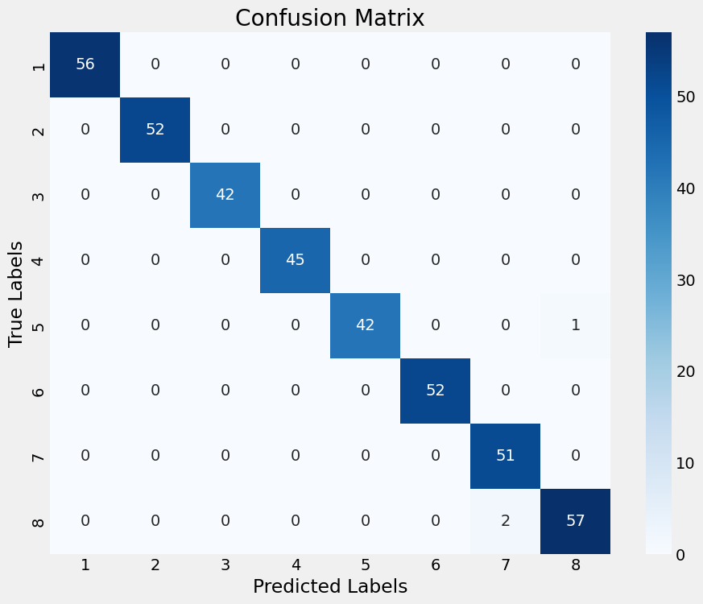

# Mango Leaf Disease Classification Project

This project aims to classify mango leaf diseases using a dataset from [Kaggle](https://www.kaggle.com/datasets/warcoder/mango-leaf-disease-dataset). Throughout the project, various deep learning models were explored to identify specific diseases affecting mango leaves, with a focus on achieving high accuracy and understanding model behavior in different scenarios.

## Dataset
The dataset comprises images of mango leaves, categorized by health status and disease type, sourced from Kaggle's Mango Leaf Disease Dataset.

## Notebooks Overview and Findings

### 1. `main.ipynb`
- **Description**: Initializes the project's environment, including TensorFlow GPU configuration. Introduces a basic CNN model, achieving an accuracy of 0.85 on trial runs, serving as a baseline for the project.
- **Contents**: Environment setup, basic CNN model implementation, and trial run results.

### 2. `w_pretrained_model_EffecientNetB0.ipynb`
- **Description**: Implements EfficientNetB0, achieving near-perfect accuracy. However, compatibility issues with TensorFlow 2.10 and the EfficientNetB0 version led to errors.
- **Contents**: EfficientNetB0 setup and training, encountered errors.

### 3. `w_pretrained_model_MobileNetV2.ipynb`
- **Description**: Utilizes MobileNetV2 for the classification task. Despite the promise of transfer learning, the desired accuracy was not achieved.
- **Contents**: MobileNetV2 implementation, training process, and results analysis.

### 4. `w_pretrained_model_Xception.ipynb`
- **Description**: Finalizes the project with the Xception model, achieving exceptional accuracy. While slightly lower than EfficientNetB0's performance, it operated without errors and allowed model saving without issues.
- **Contents**: Xception model training, evaluation, and successful model saving.

Additionally, for Xception, the batch size was dropped to 16 from 32. Otherwise the model could not execute training fully as the system run outs of memory, giving OOM error.

For Xcpetion pre-trained model, the confusion matrix for label classification provides insights into the model's performance.

**Confusion Matrix Visualization**: 

## Model Usage
The trained model can be applied to new images using the `model_run.ipynb` notebook. This flexibility allows testing against images sourced online, demonstrating the model's real-world applicability. It's noteworthy that while predictions for healthy mango leaves remain accurate across environments, disease detection accuracy may vary for images dissimilar to the dataset's environment.